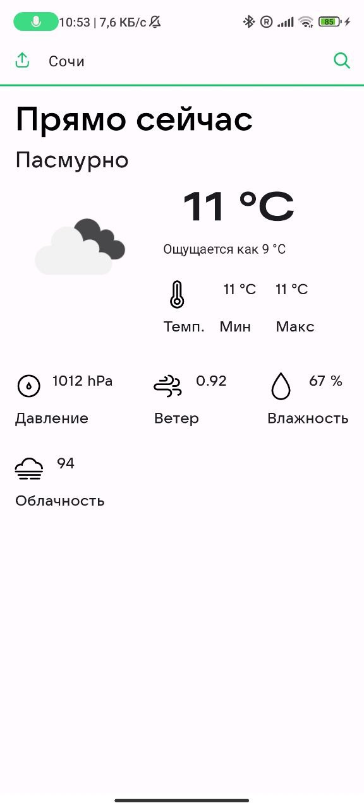
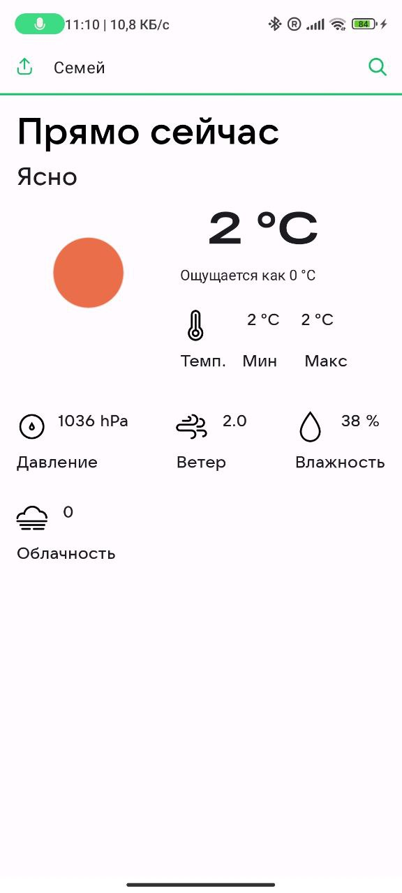
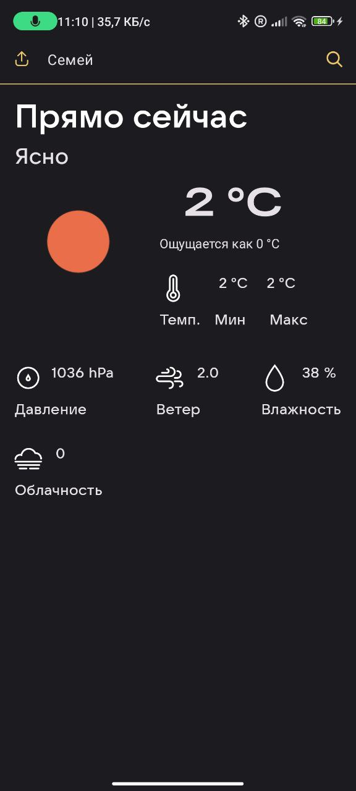
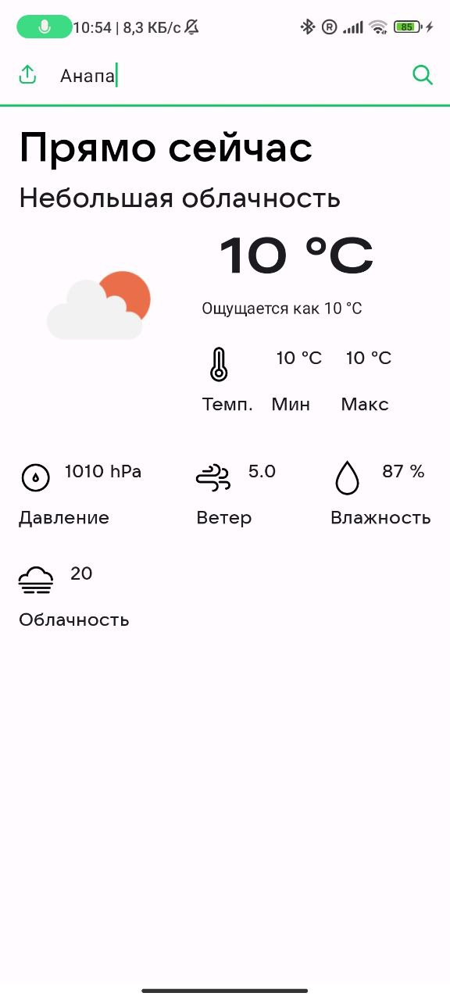
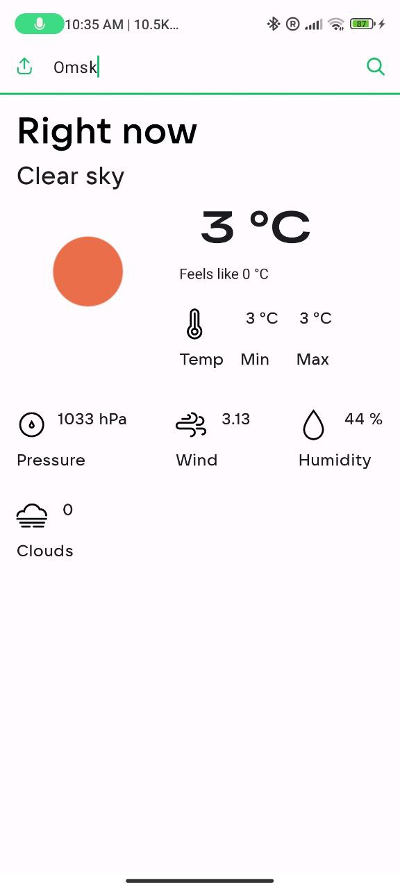
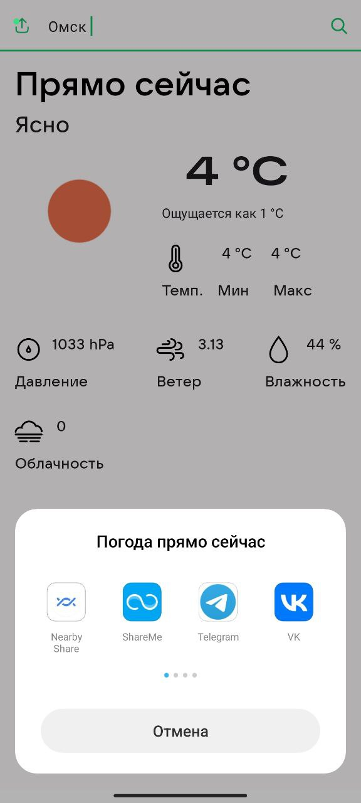
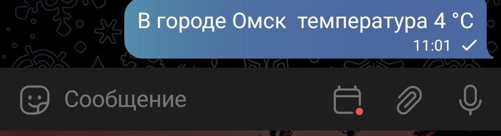
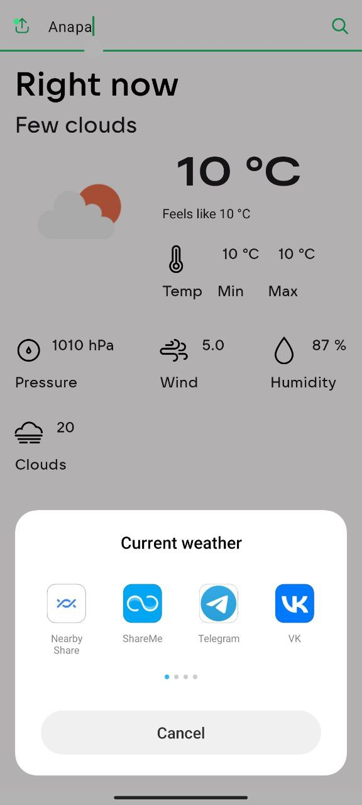
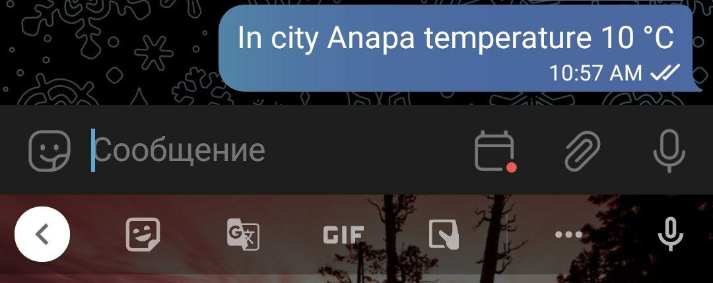
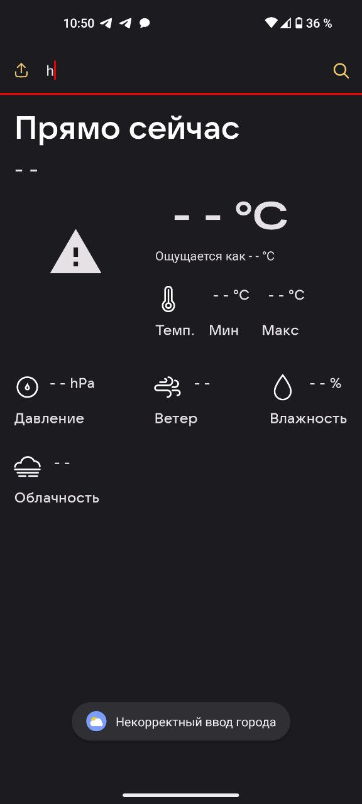

# Weather Android App

## Screenshots

## Home screen

|                       Home                       |
|:------------------------------------------------:|
|  |

## Light/Dark themes

|                   Light Theme                    |                   Dark theme                    |
|:------------------------------------------------:|:-----------------------------------------------:|
|  |  |

## Localization

|                         Russian                         |                         English                         |
|:-------------------------------------------------------:|:-------------------------------------------------------:|
|  |  |

## Share a forecast in Russian

|                       Share sheet                        |                     The sent message                  |
|:--------------------------------------------------------:|:-----------------------------------------------------:|
|  |  |

## Share a forecast in English

|                       Share sheet                        |                     The sent message                  |
|:--------------------------------------------------------:|:-----------------------------------------------------:|
|  |  |

## Error message

|           Toast with an error message             |
|:-------------------------------------------------:|
|  |

## How to run

* You need Android Studio (at least Arctic Fox) with Kotlin plugin (at least 1.6.10)S
* Add `apiKey=<YourKey>` in `local.properties` file, for
  example `apiKey="72288ebc5b893cc92a76c701c6b700b6"`
* Run -> Run 'app'

## Topics

* DI
* Navigation
* Clean Architecture
* Localization
* Theming
* Single-module
* Compose Based UI

## My contacts

* [VK](https://vk.com/liker4ik50)
* [Telegram](https://t.me/Liker4ik50)
